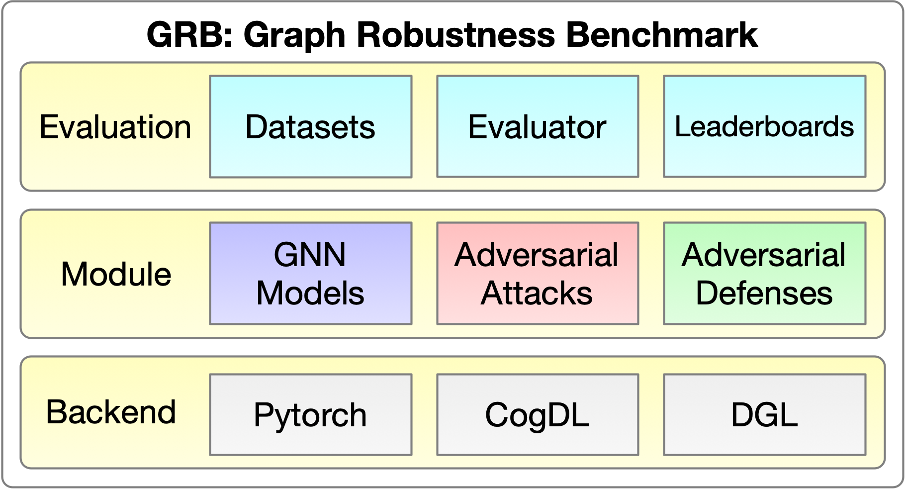
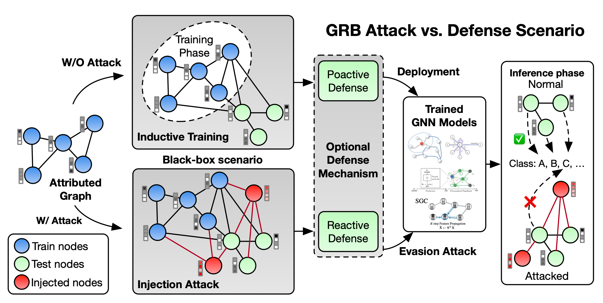

===

[](https://pypi.org/project/grb/)
[](https://grb.readthedocs.io/en/latest/?badge=latest)
[](./LICENSE)

**[Homepage](https://cogdl.ai/grb/home)** | **[Datasets](https://cogdl.ai/grb/datasets)** | **[Leaderboard](https://cogdl.ai/grb/leaderboard/cora)** | **[Documentation](https://grb.readthedocs.io/en/latest)**

**Graph Robustness Benchmark (GRB)** provides scalable, general, unified, and reproducible evaluation on the adversarial robustness of graph machine learning, especially Graph Neural Networks (GNNs). GRB has elaborated datasets, unified evaluation pipeline, reproducible leaderboards, and modular coding framework, which facilitates a fair comparison among various attacks & defenses on GNNs and promotes future research in this field. 



## Installation

Install grb via ``pip``:
```
pip install grb
```

## GRB Evaluation Scenario



GRB provides a unified evaluation scenario for fair comparisons between attacks and defenses. The scenario is **Black-box**, **Evasion**, **Inductive**, **Injection**. Take the case of a citation-graph classification system for example. The platform collects labeled data from previous papers and trains a GNN model. When a batch of new papers are submitted, it updates the graph and uses the trained model to predict labels for them. 

* **Black-box**: Both the attacker and the defender have no knowledge about the applied methods each other uses.
* **Evasion**: GNNs are already trained in trusted data (e.g. authenticated users), which are untouched by the attackers but might have natural noises. Thus, attacks will only happen during the inference phase. 
* **Inductive**: GNNs are used to classify unseen data (e.g. new users), i.e. validation or test data are unseen during training, which requires GNNs to generalize to out of distribution data.
* **Injection**: The attackers can only inject new nodes but not modify the target nodes directly. Since it is usually hard to hack into users' accounts and modify their profiles. However, it is easier to create fake accounts and connect them to existing users.

## Usage

### Training a GNN model

An example of training Graph Convolutional Network ([GCN](https://arxiv.org/abs/1609.02907)) on _grb-cora_ dataset. 

```python
import torch  # pytorch backend
from grb.dataset import Dataset
from grb.model.torch import GCN
from grb.utils.trainer import Trainer

# Load data
dataset = Dataset(name='grb-cora', mode='easy',
                  feat_norm='arctan')
# Build model
model = GCN(in_features=dataset.num_features,
            out_features=dataset.num_classes,
            hidden_features=[64, 64])
# Training
adam = torch.optim.Adam(model.parameters(), lr=0.01)
trainer = Trainer(dataset=dataset, optimizer=adam,
                  loss=torch.nn.functional.nll_loss)
trainer.train(model=model, n_epoch=200, dropout=0.5,
              train_mode='inductive')
```

### Adversarial attack

An example of applying Topological Defective Graph Injection Attack ([TDGIA](https://github.com/THUDM/tdgia)) on trained GCN model.

```python
from grb.attack.tdgia import TDGIA

# Attack configuration
tdgia = TDGIA(lr=0.01, 
              n_epoch=10,
              n_inject_max=20, 
              n_edge_max=20,
              feat_lim_min=-0.9, 
              feat_lim_max=0.9,
              sequential_step=0.2)
# Apply attack
rst = tdgia.attack(model=model,
                   adj=dataset.adj,
                   features=dataset.features,
                   target_mask=dataset.test_mask)
# Get modified adj and features
adj_attack, features_attack = rst
```

## Requirements

* scipy==1.5.2
* numpy==1.19.1
* torch==1.8.0
* networkx==2.5
* pandas~=1.2.3
* cogdl~=0.3.0.post1
* scikit-learn~=0.24.1

## Contact

If you have any question, please raise an issue or contact qinkai.zheng1028@gmail.com.
